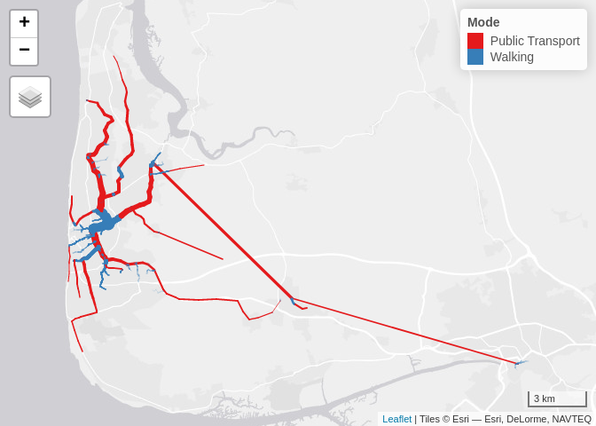

# Notes from a hackathon

Notes from a hackathon.

# Introduction

This is a collection of notes from a hackathon held at the Alan Turing
Institute in London on 2023-04-20.

# Setup

## Getting the code repos

The starting point was two code repos:

- Front end (note the use of PMTiles):
  https://github.com/ADD-William-WaltersDavis/planning_tool
- Backend code in Rust to get scores and routes for each square:
  https://github.com/adam-jb/rust_connectivity_pt_tiles

These repos were cloned from GitHub as follows:

``` bash
gh repo clone ADD-William-WaltersDavis/planning_tool
gh repo clone adam-jb/rust_connectivity_pt_tiles

# add the submodules
git submodule add https://github.com/ADD-William-WaltersDavis/planning_tool planning_tool
git submodule add https://github.com/adam-jb/rust_connectivity_pt_tiles rust_connectivity_pt_tiles
```

## Visualising the data

``` bash
ls planning_tool
```

    api.js
    App.svelte
    assets
    components
    data
    index.html
    LICENSE
    node_modules
    package.json
    package-lock.json
    README.md
    vite.config.js

Run the front end:

``` bash
cd planning_tool
npm install
# global install of vite:
sudo npm install -g vite
npm run dev
```

``` bash
```

# Working with link data

A starting point was files prepared for the event. These were copied to
the route of the project with bash as follows:

``` bash
mkdir data
mv -v ~/Downloads/*.pickle data
```

We can list the pickle files as follows:

``` python
import os
# List pickle files in route directory:
for file in os.listdir('data'):
    print(file)
```

    AA_example_links.pickle
    AA_example_links.json
    AA_example_key_nodes.pickle

``` python
import pickle
# Read the first pickle file:
with open('data/AA_example_links.pickle', 'rb') as f:
    links = pickle.load(f)
```

Show what’s in the links object, with output showning first 80
characters:

``` python
# Find length of links:
len(links)
```

    1

``` python
links.__class__
```

    <class 'dict'>

``` python
links.__sizeof__()
```

    216

``` python
links_items = links.items()
links_items.__class__
# links_items[:10]
# Convert dict to list:
```

    <class 'dict_items'>

``` python
links_list = list(links_items)
links_list.__class__
```

    <class 'list'>

``` python
len(links_list)
# Convert list to character string:
```

    1

``` python
links_str = str(links_list)
links_str[:80]
```

    "[('332550_436550', [[245949.0, 2524482.0, 3770702.0, 1557159.0, 244653.0, 604353"

We converted the object to json as follows:

``` python
# Define a function that converts the dict to json and save the output to a file:
import json
def write_json(data, filename='data/AA_example_links.json'):
    with open(filename,'w') as f:
        json.dump(data, f, indent=4)

write_json(links, 'data/AA_example_links.json')
```

Test reading as a GeoJSON file:

``` python
import geopandas as gpd
# The following fails with error:
gdf = gpd.read_file('data/AA_example_links.json')
```

## Read and visualise with R

We’ll use the following packages:

``` r
library(sf)
library(tidyverse)
library(tmap)
tmap_mode("view")
# Install mastermapr dependency:
remotes::install_github("acteng/mastermapr")
```

``` r
gdf_list = jsonlite::read_json("data/AA_example_links.json")
str(gdf_list[[1]][[1]])
```

    List of 9
     $ : num 245949
     $ : num 2524482
     $ : num 3770702
     $ : num 1557159
     $ : num 244653
     $ : int 6043538
     $ : int 5644744
     $ :List of 2
      ..$ : num -3.04
      ..$ : num 53.8
     $ :List of 2
      ..$ : num -3.04
      ..$ : num 53.8

``` r
length(gdf_list)
```

    [1] 1

``` r
# show 1st element:
length(gdf_list[[1]])
```

    [1] 21250

``` r
gdf_list[[1]][[1]]
```

    [[1]]
    [1] 245949

    [[2]]
    [1] 2524482

    [[3]]
    [1] 3770702

    [[4]]
    [1] 1557159

    [[5]]
    [1] 244653

    [[6]]
    [1] 6043538

    [[7]]
    [1] 5644744

    [[8]]
    [[8]][[1]]
    [1] -3.03542

    [[8]][[2]]
    [1] 53.81775


    [[9]]
    [[9]][[1]]
    [1] -3.035828

    [[9]][[2]]
    [1] 53.81767

``` r
# create geographic representation of first file:
gdf_origin_coords = c(
    gdf_list[[1]][[1]][[8]][[1]],
    gdf_list[[1]][[1]][[8]][[2]]
    )
gdf_destination_coords = c(
    gdf_list[[1]][[1]][[9]][[1]],
    gdf_list[[1]][[1]][[9]][[2]]
    )
gdf_matrix = rbind(gdf_origin_coords, gdf_destination_coords)
gdf_linestring = sf::st_linestring(gdf_matrix)
sfc_linestring = sf::st_sfc(gdf_linestring)
sf_linestring = sf::st_as_sf(sfc_linestring)
qtm(sf_linestring)
```

    Warning: Currect projection of shape sf_linestring unknown. Long-lat (WGS84) is
    assumed.

    PhantomJS not found. You can install it with webshot::install_phantomjs(). If it is installed, please make sure the phantomjs executable can be found via the PATH variable.


## Iterate for all links and visualise network

First we’ll generalise the previous code to a function:

``` r
link_coordinates = function(link) {
    # get origin and destination coordinates:
    gdf_origin_coords = c(
        link[[8]][[1]],
        link[[8]][[2]]
        )
    gdf_destination_coords = c(
        link[[9]][[1]],
        link[[9]][[2]]
        )
    # create matrix of coordinates:
    gdf_matrix = rbind(gdf_origin_coords, gdf_destination_coords)
    # create linestring:
    gdf_linestring = sf::st_linestring(gdf_matrix)
    # create sfc:
    sfc_linestring = sf::st_sfc(gdf_linestring)
    # create sf:
    sf_linestring = sf::st_as_sf(sfc_linestring)
    return(sf_linestring)
}
# Test the function with the first link:
link_coordinates(gdf_list[[1]][[1]])
```

    Simple feature collection with 1 feature and 0 fields
    Geometry type: LINESTRING
    Dimension:     XY
    Bounding box:  xmin: -3.035828 ymin: 53.81767 xmax: -3.03542 ymax: 53.81775
    CRS:           NA
                                   x
    1 LINESTRING (-3.03542 53.817...

``` r
links = gdf_list[[1]]

links_to_sfc = function(links) {
    list_linstrings = lapply(links, link_coordinates)
    # class(list_linstrings)
    # qtm(list_linstrings[[2]])
    # combine the sf linstrings into a single object:
    # Note: inefficient implemenation TODO, make more efficient:
    # sf_links = do.call(rbind, list_linstrings)
    sf_links = mastermapr::fastrbindsf(list_linstrings)
    return(sf_links)
}
links_sf = links_to_sfc(gdf_list[[1]])
class(links_sf)
```

    [1] "sf"         "data.frame"

``` r
qtm(links_sf)
```

    Warning: Currect projection of shape links_sf unknown. Long-lat (WGS84) is
    assumed.


## Get attribute data for links

``` r
# Function to get link attributes
# For testing:
# link = gdf_list[[1]][[1]]
link_attributes = function(
    link,
    attribute_names = c(
        'Business',
        'Education',
        'Entertainment',
        'Shopping',
        'Visit friends',
        'start_node',
        'end_node',
        'start_longlat',
        'end_longlat'
        )
    ) {
    # get origin and destination coordinates:
    link_id = link[[1]]
    link_length = link[[2]]
    # Subset first 7 elements of list:
    link_attributes = link[1:7]
    # Create a data frame:
    link_df = data.frame(link_attributes)
    names(link_df) = attribute_names[1:7]
    return(link_df)
}
# Test on a single link:
link_attributes(gdf_list[[1]][[1]])
```

      Business Education Entertainment Shopping Visit friends start_node end_node
    1   245949   2524482       3770702  1557159        244653    6043538  5644744

``` r
links_to_df = function(links) {
    list_dfs = pbapply::pblapply(links, link_attributes)
    data.table::rbindlist(list_dfs)
}

# Function to get link attributes for all links:
links_to_sf = function(links, subset_on = NULL, keep_n = Inf, keep_percent = 100, pt_threshold = 100326060) {
    links_df = links_to_df(links)
    if(!is.null(subset_on)) {
        # indices of top keep_n items:
        if(keep_n < nrow(links_df)) {
            indices = order(links_df[[subset_on]],  decreasing = TRUE)
            indices = indices[seq(keep_n)]
            links_df = links_df[indices, ]
        }
        links_sfc = links_to_sfc(links[indices])
    } else {
        links_sfc = links_to_sfc(links)
    }
    # Create a spatial data frame:
    # class(links_sfc$x)
    links_sf = sf::st_sf(geometry = sf::st_geometry(links_sfc), links_df, crs = 4326)
    links_sf$Mode = dplyr::case_when(
        links_sf$start_node > pt_threshold ~ "Public Transport",
        # TODO: add more rules
        TRUE ~ "Walking"
    )
    links_sf
}
links_sf = links_to_sf(gdf_list[[1]], keep_n = 1000, subset_on = "Business")
names(links_sf)
```

    [1] "Business"      "Education"     "Entertainment" "Shopping"     
    [5] "Visit friends" "start_node"    "end_node"      "geometry"     
    [9] "Mode"         

``` r
nrow(links_sf)
```

    [1] 1000

``` r
links_sf |>
  select(Business:`Visit friends`) |>
  sf::st_drop_geometry() |>
  summary()
```

        Business         Education        Entertainment          Shopping       
     Min.   :  38870   Min.   :       0   Min.   :        0   Min.   :       0  
     1st Qu.:  62706   1st Qu.:       0   1st Qu.:        0   1st Qu.:   63482  
     Median : 121244   Median :   85536   Median :   170880   Median :  210789  
     Mean   : 340392   Mean   : 1444212   Mean   : 14542133   Mean   : 1231064  
     3rd Qu.: 247265   3rd Qu.:  829523   3rd Qu.:  3478100   3rd Qu.: 1370317  
     Max.   :7104814   Max.   :39602559   Max.   :332170990   Max.   :24580720  
     Visit friends    
     Min.   :      0  
     1st Qu.:  10883  
     Median :  78818  
     Mean   : 291217  
     3rd Qu.: 233955  
     Max.   :6825380  

## Style the network

We can now visualise the network with the `tmap` package:

``` r
links_sf |>
  mutate(across(Business:`Visit friends`, sqrt)) |>
  tm_shape() +
  tm_lines(lwd = "Business", scale = 15, col = "Mode", palette = "Set1") +
  tm_scale_bar() 
```

    Legend for line widths not available in view mode.


``` r
table(links_sf$Mode)
```


    Public Transport          Walking 
                 190              810 

``` r
links_sf |>
  mutate(across(Business:`Visit friends`, sqrt)) |>
  tm_shape() +
  tm_lines(lwd = "Visit friends", scale = 15, col = "Mode", palette = "Set1") +
  tm_scale_bar() 
```

    Legend for line widths not available in view mode.



``` r
links_sf_friends = links_to_sf(gdf_list[[1]], keep_n = 1000, subset_on = "Visit friends")
table(links_sf_friends$Mode)
```


    Public Transport          Walking 
                 215              785 

``` r
links_sf_friends |>
  mutate(across(Business:`Visit friends`, sqrt)) |>
  tm_shape() +
  tm_lines(lwd = "Visit friends", scale = 15, col = "Mode", palette = "Set1") +
  tm_scale_bar() 
```

    Legend for line widths not available in view mode.


``` r
links_sf_education = links_to_sf(gdf_list[[1]], keep_n = 1000, subset_on = "Education")
table(links_sf_education$Mode)
```


    Public Transport          Walking 
                 210              790 

``` r
links_sf_education |>
  mutate(across(Business:`Visit friends`, sqrt)) |>
  tm_shape() +
  tm_lines(lwd = "Education", scale = 15, col = "Mode", palette = "Set1") +
  tm_scale_bar() 
```

    Legend for line widths not available in view mode.


